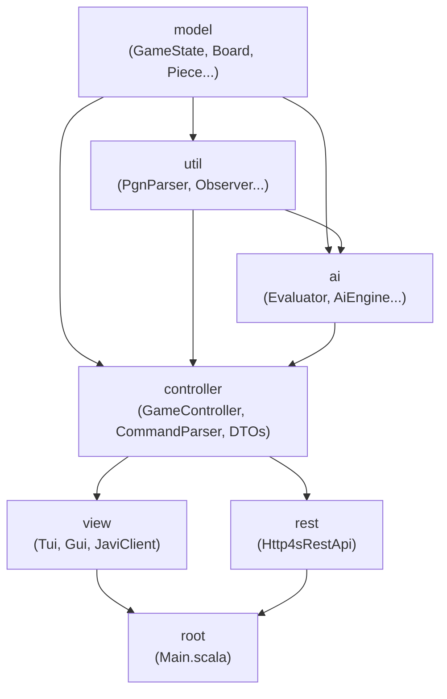

# Walkthrough: Modularisierung & Http4s Migration

## Ausgangssituation

Das Projekt war ein **monolithisches sbt-Projekt** — eine einzige `build.sbt`, alle Scala-Quelldateien unter `src/main/scala/chess/`, ein einziger `.jar`. Der REST-Server lief mit **Pekko HTTP** (Actor-System).

**Problem mit dem Monolithen:**
- Alles kennt alles: `view` darf eigentlich nur rendern, hatte aber HTTP-Server-Code
- Keine klare Dependency-Richtung zwischen Schichten
- Pekko HTTP ist Actor-basiert und imperativ — nicht idiomatisch für moderne Scala 3

---

## Änderung 1: `build.sbt` — Monolith → Multi-Projekt

### Vorher
```scala
lazy val root = (project in file("."))
  .settings(
    name := "chess-functional-improvements",
    libraryDependencies ++= Seq(
      "org.scalafx" %% "scalafx" % "20.0.0-R31",
      "org.apache.pekko" %% "pekko-http" % "1.0.1",
      // ... alles zusammen in einem Topf
    )
  )
```

### Nachher
```scala
lazy val model      = (project in file("model"))   // keine externe Dependencies
lazy val util       = (project in file("util"))    .dependsOn(model)    // Parser
lazy val ai         = (project in file("ai"))      .dependsOn(model, util)
lazy val controller = (project in file("controller")).dependsOn(model, util, ai)
lazy val view       = (project in file("view"))    .dependsOn(controller)  // ScalaFX
lazy val rest       = (project in file("rest"))    .dependsOn(controller)  // Http4s
lazy val root       = (project in file("."))       .aggregate(util, model, ai, controller, view, rest)
```

### Warum so?
Die Abhängigkeiten folgen dem **Dependency Inversion Principle**: Die inneren Schichten (`model`) kennen die äußeren (`view`, `rest`) nicht. Die Richtung ist:
```
view ──┐
       ├──► controller ──► util ──► model
rest ──┘          └──────────────────────►ai
```

> [!IMPORTANT]
> Die `util`-Schicht **dependsOn model** (nicht umgekehrt), weil `ParserRegistry` und `PgnParser` `chess.model.GameState`, `Move` etc. brauchen.

---

## Änderung 2: Ordnerstruktur — Dateien in Module verschoben

Mit `git mv` (Versionskontrolle bleibt erhalten) wurden alle Quelldateien in ihre Modul-Ordner verschoben:

| Vorher | Nachher |
|---|---|
| `src/main/scala/chess/model/` | `model/src/main/scala/chess/model/` |
| `src/main/scala/chess/util/` | `util/src/main/scala/chess/util/` |
| `src/main/scala/chess/ai/` | `ai/src/main/scala/chess/ai/` |
| `src/main/scala/chess/controller/` | `controller/src/main/scala/chess/controller/` |
| `src/main/scala/chess/view/` | `view/src/main/scala/chess/view/` |
| `src/test/scala/chess/...` | Analog in jeweiligem Modul |

**Paketnamen** (`package chess.model` etc.) bleiben **unverändert** — das ist die Stärke von sbt Multi-Projekten. Die physische Ordnerstruktur ändert sich, die logische Paketstruktur nicht.

---

## Änderung 3: `CommandParser` — von `view` nach `controller` verschoben

### Problem
`CommandParser` war in `chess.view`, wurde aber sowohl von der TUI (`Tui.scala`) als auch vom REST-Server gebraucht.
Wenn `rest` von `view` abhängen würde, entstünde ein **zirkulärer Dependency** (oder `view` bringt ScalaFX mit in den Server).

### Lösung
```
git mv view/src/main/scala/chess/view/CommandParser.scala \
        controller/src/main/scala/chess/controller/CommandParser.scala
```
Paketdeklaration angepasst: `package chess.view` → `package chess.controller`

Ebenso der dazugehörige Test `CommandParserSpec`.

---

## Änderung 4: Shared API-DTOs in `controller` — `ApiModels.scala` [NEU]

### Problem
`GameStateResponse` und `CommandRequest` (die JSON-Datenklassen) wurden vorher in `RestApi.scala` definiert. 
`Gui.scala` im `view`-Modul brauchte `GameStateResponse` aber auch (für den HTTP-Client).

### Lösung: Neue Datei `controller/src/main/scala/chess/controller/ApiModels.scala`
```scala
package chess.controller

case class CommandRequest(command: String)
case class GameStateResponse(fen: String, displayFen: String, pgn: String, ...)
```

Da `view` und `rest` beide von `controller` abhängen, funktioniert das sauber ohne Zirkel.

---

## Änderung 5: Pekko HTTP → Http4s (`RestApi.scala` gelöscht, `Http4sRestApi.scala` [NEU])

### Warum Http4s?
Http4s ist **funktional und typensicher** — alles ist ein `IO`-Effekt, Routen sind reine Funktionen:
```scala
// Http4s DSL — reine Funktion: Request => IO[Response]
case GET -> Root / "api" / "state" =>
  Ok(buildStateResponse(currentState.get()).asJson)
```

Pekko HTTP war imperativ und Actor-basiert:
```scala
// Pekko — Direktiven-Stil mit impliziten Actor-Systemen
path("state") {
  get {
    complete(HttpEntity(..., response.asJson.noSpaces))
  }
}
```

### Was bleibt gleich?
Die **3 Endpunkte** sind identisch:
- `GET /api/state` — liefert den kompletten Spielzustand als JSON
- `POST /api/command` — nimmt einen Befehl entgegen (`e2e4`, `flip`, etc.)
- `GET /api/legal-moves?square=e2` — liefert legale Zielfelder

### CORS-Middleware
```scala
// Pekko: manuell Respondheader setzen
respondWithHeaders(List(`Access-Control-Allow-Origin`.*, ...))

// Http4s: deklarative Middleware (eleganter)
val app = CORS.policy
  .withAllowOriginAll
  .withAllowMethodsIn(Set(Method.GET, Method.POST, Method.OPTIONS))
  .apply(routes)
  .orNotFound
```

### Observer-Brücke
Der `Http4sRestApi` implementiert weiterhin `Observer[AppState]` und nutzt eine `AtomicReference` — das bleibt gleich, weil `GameController` mutable und imperativ ist. Die Http4s-Routen lesen daraus mit `currentState.get()`.

---

## Änderung 6: `JaviClient.scala` — Pekko HTTP Client → Java 11 HttpClient

Das GUI (`Gui.scala`) brauchte einen HTTP-Client, um den REST-Server zu pollen.
Vorher war das ein Pekko-HTTP-Client (Actor-System), was bedeutete: das `view`-Modul hatte Pekko als Dependency.

### Nachher: Java 11 `HttpClient` (in der JDK, keine extra Dependency)
```scala
private val httpClient = HttpClient.newBuilder().executor(ec).build()

def fetchState(): Future[Either[String, GameStateResponse]] =
  val request = HttpRequest.newBuilder()
    .uri(URI.create(s"$baseUrl/api/state"))
    .GET().build()
  httpClient.sendAsync(request, BodyHandlers.ofString())
    .asScala
    .map(r => decode[GameStateResponse](r.body()).left.map(_.getMessage))(ec)
```

Das `view`-Modul hat damit **keine Pekko-Dependency mehr**.

---

## Änderung 7: `Main.scala` — Server mit Cats Effect starten

### Vorher (imperativ mit Pekko)
```scala
val restApi = new RestApi()
GameController.addObserver(restApi)
restApi.start(8080) // startet Pekko Actor-System intern
```

### Nachher (Cats Effect `IO`)
```scala
val restApi = new Http4sRestApi()
GameController.addObserver(restApi)

val serverConfig = EmberServerBuilder.default[IO]
  .withHost(ipv4"0.0.0.0")
  .withPort(port"8080")
  .withHttpApp(restApi.app)
  .build

activeRestApi = Some(serverConfig.useForever.start.unsafeRunSync())
```

`EmberServer` ist der empfohlene Http4s-Backend-Server — async, NIO-basiert, kein Actor-Overhead.

---

## Testergebnis

```
✅ 471 Tests, 0 Fehler
   model:      18 Tests
   util:      149 Tests
   ai:         44 Tests
   controller: 94 Tests (inkl. CommandParserSpec)
   view:       68 Tests
   root:        3 Tests (MainSpec, TrainMainSpec)
```

---

## Abhängigkeitsdiagramm (final)


